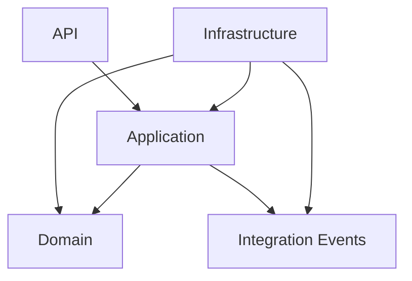

# SIXPAY CONNECT — Backend Engineering Generation Contract

| Métadonnée | Valeur |
|---|---|
| Statut | **FROZEN — Contrat officiel de génération** |
| Version | **1.0** |
| Date d'effet | **26 juillet 2026** |
| Périmètre | Backend SIXPAY CONNECT |
| Baseline associée | `SIXPAY_BACKEND_TECHNOLOGY_MATRIX.md` v1.0 |
| Première application | Golden module `partner` |

## 1. Objet

Le présent document définit les règles obligatoires pour générer, développer, modifier et valider le code backend de SIXPAY CONNECT.

Il s'adresse :

- aux développeurs ;
- aux reviewers ;
- aux outils de génération ;
- aux assistants d'intelligence artificielle ;
- aux pipelines d'intégration continue.

Il ne constitue pas une nouvelle architecture. Il traduit en contraintes d'implémentation les décisions déjà arrêtées dans les Volumes 1 à 5 et dans la matrice technologique officielle.

L'objectif est d'empêcher qu'un outil de génération :

- invente une nouvelle structure ;
- introduise une technologie non approuvée ;
- couple les domaines métier ;
- déplace les responsabilités entre les couches ;
- produise du code incomplet, non sécurisé ou non testable.

## 2. Vocabulaire normatif

Les termes suivants sont normatifs :

| Terme | Signification |
|---|---|
| **DOIT** | Exigence obligatoire |
| **NE DOIT PAS** | Interdiction absolue |
| **DEVRAIT** | Règle attendue, sauf justification documentée |
| **PEUT** | Option autorisée dans le périmètre défini |

Une dérogation à une règle **DOIT** ou **NE DOIT PAS** exige une décision d'architecture explicite.

## 3. Ordre d'autorité

En cas de divergence, l'ordre d'autorité est :

1. les décisions d'architecture approuvées dans les Volumes 1 à 5 ;
2. la matrice technologique officielle du backend ;
3. le présent contrat ;
4. les spécifications fonctionnelles et critères d'acceptation du module ;
5. les modèles de référence déjà validés dans le repository ;
6. les conventions locales du code existant.

Une instruction ponctuelle ne modifie pas implicitement une décision gelée. Toute évolution structurante **DOIT** être identifiée comme telle, analysée et enregistrée.

Lorsqu'une information nécessaire n'existe dans aucune source d'autorité, le générateur **NE DOIT PAS** l'inventer silencieusement. Il **DOIT** :

1. identifier l'ambiguïté ;
2. proposer l'option minimale compatible avec l'architecture ;
3. demander une décision si le choix affecte le domaine, un contrat public, la sécurité, les données ou les dépendances.

## 4. Baseline technologique obligatoire

Tout code généré **DOIT** respecter la baseline suivante :

| Élément | Baseline |
|---|---|
| Java | `21` |
| Maven | `3.9.11`, plage autorisée `[3.9.6,4.0.0)` |
| Spring Boot | `4.1.0` |
| Spring Cloud | `2025.1.2` |
| MapStruct | `1.6.3` |
| Springdoc OpenAPI | `3.0.3` |
| PostgreSQL | `15.x` |

Les versions gérées par `sixpay-bom`, Spring Boot BOM ou Spring Cloud BOM **NE DOIVENT PAS** être redéclarées dans les modules.

Le générateur **NE DOIT PAS** :

- ajouter un BOM ;
- remplacer un starter par une combinaison arbitraire de dépendances internes ;
- mettre à niveau une dépendance isolément ;
- utiliser une version dynamique ;
- introduire un framework alternatif pour une capacité déjà couverte.

## 5. Structure du repository

La structure Maven officielle est :

```text
backend/
├── pom.xml
├── sixpay-bom/
├── common/
├── shared-kernel/
├── security/
├── integration/
├── customer/
├── partner/
├── subscription/
├── payment/
├── accounting/
├── reporting/
├── notification/
├── administration/
├── bootstrap/
└── tests/
```

### 5.1 Règles de modules

1. Tous les modules, sauf `bootstrap`, **DOIVENT** être des bibliothèques JAR non exécutables.
2. `bootstrap` **DOIT** être l'unique point d'entrée Spring Boot.
3. Seul `bootstrap` **DOIT** porter `@SpringBootApplication` et le packaging exécutable Spring Boot.
4. Un module métier **NE DOIT PAS** déclarer une seconde application Spring Boot.
5. Un module métier **NE DOIT PAS** dépendre directement d'un autre module métier.
6. `bootstrap` **PEUT** assembler les modules nécessaires à l'application exécutable.
7. `tests` **PEUT** dépendre de plusieurs modules pour les tests transverses et end-to-end.
8. Une dépendance entre modules **DOIT** être minimale, justifiée et orientée dans le sens défini par l'architecture.

### 5.2 Responsabilités des modules transverses

| Module | Responsabilité autorisée | Responsabilité interdite |
|---|---|---|
| `common` | Composants techniques réellement transverses | Logique métier ou dépendance vers un domaine |
| `shared-kernel` | Concepts métier invariants et explicitement partagés | Fourre-tout métier ou dépendance à Spring/JPA |
| `security` | Contrats et mécanismes de sécurité de plateforme | Décisions métier propres à un domaine |
| `integration` | Connecteurs et abstractions d'intégration externe | Orchestration métier ou stockage d'agrégats |
| `bootstrap` | Assemblage, démarrage et configuration d'exécution | Logique métier |

Un code ne **DOIT PAS** être placé dans `common` ou `shared-kernel` uniquement parce qu'il est utilisé deux fois. Le partage exige une responsabilité stable et un propriétaire clair.

## 6. Structure interne d'un module métier

Chaque module métier **DOIT** suivre la structure Maven et Java suivante :

```text
<module>/
├── pom.xml
└── src/
    ├── main/
    │   ├── java/
    │   │   └── com/sixpay/<module>/
    │   │       ├── api/
    │   │       ├── application/
    │   │       ├── domain/
    │   │       ├── infrastructure/
    │   │       └── events/
    │   └── resources/
    └── test/
        ├── java/
        └── resources/
```

Les packages Java **DOIVENT** être en minuscules.

### 6.1 Responsabilités par couche

| Couche | Responsabilités |
|---|---|
| `api` | Contrôleurs REST, modèles de requête/réponse, validation d'entrée, mapping HTTP, gestion normalisée des erreurs |
| `application` | Cas d'usage, commandes, requêtes, orchestration, frontières transactionnelles, ports entrants et sortants |
| `domain` | Agrégats, entités, Value Objects, invariants, services de domaine, événements de domaine, interfaces de repository |
| `infrastructure` | JPA, Kafka, clients externes, implémentation des ports, configuration technique, mapping de persistance |
| `events` | Contrats d'événements d'intégration publiés ou consommés par le module |

### 6.2 Direction des dépendances



Les flèches représentent les dépendances de compilation autorisées.

Les contraintes suivantes sont obligatoires :

- `domain` **NE DOIT PAS** importer Spring, JPA, Kafka, HTTP ou une classe d'infrastructure ;
- `application` **NE DOIT PAS** dépendre d'une implémentation d'infrastructure ;
- `api` **NE DOIT PAS** accéder directement à JPA ou à un client externe ;
- `infrastructure` **DOIT** implémenter les ports définis par le domaine ou l'application ;
- les événements d'intégration **NE DOIVENT PAS** exposer une entité JPA ou un agrégat interne.

## 7. Règles de modélisation du domaine

### 7.1 Agrégats et invariants

1. Chaque Aggregate Root **DOIT** protéger ses invariants.
2. Son état **NE DOIT PAS** être modifiable par des setters publics génériques.
3. Toute transition d'état **DOIT** passer par une opération métier nommée.
4. Une opération invalide **DOIT** échouer explicitement, sans laisser l'agrégat dans un état partiel.
5. Un repository d'écriture **DOIT** manipuler un Aggregate Root, pas des DTO ni des projections.
6. Un domaine **NE DOIT PAS** contenir de logique de présentation, de transport ou de persistance.

### 7.2 Value Objects

Un Value Object **DOIT** :

- être immuable ;
- valider ses invariants à la construction ;
- utiliser une égalité fondée sur sa valeur ;
- empêcher la représentation d'un état invalide ;
- encapsuler les règles associées à la valeur.

Les identifiants métier importants **DEVRAIENT** être représentés par des types dédiés plutôt que par des `String` ou `UUID` nus dans tout le code.

### 7.3 Montants et dates

- Les montants **DOIVENT** utiliser `BigDecimal`.
- `float` et `double` **NE DOIVENT PAS** représenter une valeur monétaire.
- La devise **DOIT** être explicite lorsqu'un montant peut être multidevise.
- Les instants techniques **DOIVENT** utiliser `Instant` en UTC.
- Les règles dépendantes du temps **DOIVENT** recevoir un `Clock`.
- Le domaine **NE DOIT PAS** appeler directement `Instant.now()` ou `LocalDateTime.now()`.
- Les dates calendaires métier **PEUVENT** utiliser `LocalDate` lorsqu'aucun fuseau n'est impliqué.

### 7.4 Événements de domaine

Un événement de domaine :

- **DOIT** exprimer un fait métier passé ;
- **DOIT** être immuable ;
- **DOIT** être produit par le domaine ;
- **NE DOIT PAS** contenir une dépendance Kafka ;
- **NE DOIT PAS** déclencher directement un appel réseau.

La conversion d'un événement de domaine en événement d'intégration appartient à l'application ou à l'infrastructure.

## 8. Standards Java 21

Le code généré **DOIT** être idiomatique, lisible et compatible Java 21.

### 8.1 Immutabilité

- Les objets immuables **DOIVENT** être privilégiés.
- Les `record` **DEVRAIENT** être utilisés pour les DTO et contrats de données immuables adaptés.
- Les collections reçues ou exposées **DOIVENT** être protégées par copie défensive lorsque nécessaire.
- Les champs **DEVRAIENT** être `final` dès que leur cycle de vie le permet.

### 8.2 Utilisation des fonctionnalités Java

- Les expressions `switch` et le pattern matching **PEUVENT** être utilisés lorsqu'ils améliorent la clarté.
- Les types `sealed` **PEUVENT** modéliser une hiérarchie réellement fermée.
- `Optional` **PEUT** être utilisé comme type de retour.
- `Optional` **NE DOIT PAS** être utilisé comme champ JPA, paramètre de méthode ou substitut systématique à la validation.
- Les Stream **NE DOIVENT PAS** remplacer une boucle plus claire ou introduire des effets de bord cachés.

### 8.3 Concurrence

- Le code métier **NE DOIT PAS** créer directement des threads.
- Les exécuteurs **DOIVENT** être configurés et injectés centralement.
- Les virtual threads **PEUVENT** être activés uniquement au niveau de l'application, pour des traitements bloquants identifiés et après tests de charge.
- Une transaction JPA **NE DOIT PAS** être partagée entre threads.
- Tout traitement concurrent **DOIT** définir sa stratégie d'idempotence, de verrouillage ou de contrôle de version.

### 8.4 Exceptions

- Les exceptions **DOIVENT** exprimer une cause précise.
- Une exception **NE DOIT PAS** être capturée puis ignorée.
- `catch (Exception)` **NE DOIT PAS** être utilisé pour masquer une erreur.
- Les exceptions techniques **DOIVENT** être traduites aux frontières appropriées.
- Les messages externes **NE DOIVENT PAS** exposer de stack trace, secret ou détail interne.

## 9. Standards Spring Boot 4

### 9.1 Injection et configuration

- L'injection par constructeur **DOIT** être utilisée.
- L'injection dans les champs **NE DOIT PAS** être utilisée.
- Les propriétés structurées **DOIVENT** utiliser `@ConfigurationProperties`.
- Les propriétés obligatoires **DOIVENT** être validées au démarrage.
- Les secrets **NE DOIVENT PAS** avoir de valeur par défaut dans le repository.
- Un profil Spring **NE DOIT PAS** modifier une règle métier.

### 9.2 Composants Spring

- Les annotations Spring **DOIVENT** rester hors du domaine.
- Le component scanning **DOIT** être limité à l'espace SIXPAY contrôlé.
- Les bibliothèques transverses **DEVRAIENT** exposer une configuration explicite ou une auto-configuration maîtrisée.
- Une auto-configuration **DOIT** être conditionnelle et testée.
- Un bean **NE DOIT PAS** être déclaré en double pour contourner un conflit de configuration.

### 9.3 Clients HTTP

Pour les intégrations synchrones bloquantes :

- `RestClient` **DOIT** être privilégié ;
- le starter Spring Boot 4 `spring-boot-starter-restclient` **DOIT** être utilisé ;
- la configuration doit rester compatible avec `RestClientAutoConfiguration` ;
- `RestTemplate` **NE DOIT PAS** être introduit ;
- les timeouts **DOIVENT** être explicites ;
- les erreurs externes **DOIVENT** être traduites en erreurs d'intégration stables ;
- les logs **NE DOIVENT PAS** contenir de credentials ou de payload sensible.

Un client réactif **NE DOIT PAS** être introduit uniquement pour effectuer un appel HTTP ponctuel dans une application bloquante.

## 10. Transactions et persistance

### 10.1 Transactions

- La frontière transactionnelle **DOIT** se situer dans la couche application.
- Un contrôleur **NE DOIT PAS** porter la transaction métier.
- Un agrégat **NE DOIT PAS** connaître la transaction.
- Un repository **NE DOIT PAS** contenir l'orchestration transactionnelle.
- Une requête de lecture **DEVRAIT** être explicitement `readOnly`.
- Un appel réseau lent **NE DOIT PAS** être maintenu dans une transaction de base de données sans justification.
- La publication fiable d'un événement lié à une transaction **DOIT** utiliser l'Outbox.

### 10.2 JPA

- Les entités JPA **DOIVENT** rester dans `infrastructure`.
- Une entité JPA **NE DOIT PAS** être exposée par l'API.
- Les associations **DOIVENT** être `LAZY` par défaut.
- `EAGER` **NE DOIT PAS** être utilisé comme correctif à un problème de requête.
- `CascadeType.ALL` **NE DOIT PAS** être appliqué sans analyse du cycle de vie.
- Les requêtes **DOIVENT** éviter les problèmes N+1 par un chargement explicite.
- Le verrouillage optimiste **DOIT** être utilisé lorsqu'une concurrence de mise à jour est possible.
- Open Session in View **DOIT** être désactivé.
- Les contraintes importantes **DOIVENT** également être garanties par PostgreSQL.

### 10.3 Flyway

- Toute évolution de schéma **DOIT** être réalisée par Flyway.
- Une migration appliquée **NE DOIT PAS** être modifiée.
- Une correction **DOIT** être portée par une nouvelle migration.
- Une migration **DOIT** être déterministe et compatible avec le déploiement prévu.
- Le schéma produit **DOIT** être testé sur PostgreSQL, pas uniquement sur une base de substitution.

## 11. Contrats API

### 11.1 Conception

- Les API **DOIVENT** être API-first et documentées avec OpenAPI 3.
- Les endpoints publics **DOIVENT** être versionnés.
- Les ressources et opérations **DOIVENT** utiliser le vocabulaire métier officiel.
- Les DTO d'API **DOIVENT** être distincts du domaine et des entités JPA.
- La validation syntaxique appartient à l'API ; les invariants appartiennent au domaine.
- Les réponses d'erreur **DOIVENT** utiliser un format uniforme fondé sur `ProblemDetail`.
- Les dates et heures échangées **DOIVENT** utiliser ISO 8601.

### 11.2 Commandes sensibles

Une opération financière ou non naturellement idempotente :

- **DOIT** accepter ou produire une clé d'idempotence selon le contrat fonctionnel ;
- **DOIT** détecter les doublons ;
- **DOIT** restituer un résultat cohérent lors d'un replay ;
- **NE DOIT PAS** réexécuter silencieusement une opération bancaire déjà validée.

### 11.3 Pagination

Une collection potentiellement volumineuse **DOIT** être paginée. L'API **NE DOIT PAS** exposer directement un type Spring Data `Page` comme contrat public.

## 12. Sécurité by design

### 12.1 Authentification et autorisation

- Les API protégées **DOIVENT** utiliser OAuth 2.0 / OpenID Connect et JWT selon l'architecture.
- La politique d'accès **DOIT** être restrictive par défaut.
- Les rôles et permissions **DOIVENT** être vérifiés côté serveur.
- Le domaine **NE DOIT PAS** dépendre de `SecurityContextHolder`.
- L'identité utile au cas d'usage **DOIT** être transmise sous une forme applicative minimale.
- Une décision métier d'autorisation **DOIT** rester explicite et testable.

### 12.2 Données et secrets

- Aucun secret **NE DOIT** être commité.
- Les secrets **DOIVENT** provenir de Vault ou du mécanisme externe approuvé.
- Les tokens, mots de passe, clés, données bancaires et informations personnelles sensibles **NE DOIVENT PAS** être journalisés.
- Les données sensibles **DOIVENT** être masquées dans les erreurs, traces et métriques.
- Les communications externes **DOIVENT** utiliser TLS selon la baseline.

### 12.3 Validation et erreurs

- Toute entrée externe **DOIT** être validée.
- Les longueurs, formats, valeurs autorisées et bornes numériques **DOIVENT** être explicites.
- Une erreur d'autorisation **NE DOIT PAS** révéler l'existence d'une ressource inaccessible.
- Une erreur technique **NE DOIT PAS** divulguer la topologie, les requêtes SQL ou les données internes.

### 12.4 Audit

Les opérations sensibles **DOIVENT** produire un audit contenant au minimum :

- l'acteur ;
- l'action ;
- la cible ;
- le résultat ;
- l'horodatage UTC ;
- l'identifiant de corrélation.

L'audit **DOIT** être distinct d'un simple log applicatif et respecter les exigences de traçabilité et de conformité COBAC définies dans les volumes précédents.

## 13. Événements et messaging

### 13.1 Contrats

Un événement d'intégration **DOIT** être :

- immuable ;
- versionné ;
- indépendant des classes JPA ;
- documenté ;
- compatible avec les consommateurs existants.

Il **DOIT** porter les métadonnées prévues par le contrat d'événement, notamment l'identité de l'événement, son type, sa version, son horodatage et les identifiants de corrélation nécessaires.

### 13.2 Publication

- Une publication déclenchée par une transaction métier **DOIT** passer par l'Outbox.
- Le producteur **NE DOIT PAS** supposer une livraison exactement une fois.
- La sérialisation **DOIT** être stable et testée.
- Une évolution de schéma **DOIT** préserver la compatibilité définie.

### 13.3 Consommation

- Un consumer **DOIT** être idempotent.
- Les retries **DOIVENT** être bornés.
- Un échec définitif **DOIT** être dirigé vers une dead-letter topic.
- Le replay **DOIT** être contrôlé, traçable et sans double effet métier.
- Un message invalide **NE DOIT PAS** bloquer indéfiniment la partition.

## 14. Observabilité

Tout flux critique **DOIT** être observable sans exposer de données sensibles.

Le code généré **DOIT** prévoir :

- des logs structurés ;
- un identifiant de corrélation propagé ;
- des métriques métier et techniques utiles ;
- des traces distribuées pour les appels externes ;
- des indicateurs de succès, rejet, timeout, retry et dead-letter ;
- des health indicators pour les dépendances critiques lorsque pertinent.

La cardinalité des labels de métriques **DOIT** être bornée. Un identifiant de transaction, de client ou d'utilisateur **NE DOIT PAS** devenir un label de métrique non borné.

## 15. Tests obligatoires

### 15.1 Pyramide de tests

| Type | Objectif | Dépendances |
|---|---|---|
| Test de domaine | Invariants, transitions et règles métier | Aucun contexte Spring |
| Test d'application | Cas d'usage, orchestration et erreurs | Ports remplacés par doubles contrôlés |
| Test de persistence | Mapping JPA, requêtes et contraintes | PostgreSQL Testcontainer |
| Test d'intégration | Kafka, Redis, HTTP ou sécurité | Composant réel ou environnement contrôlé |
| Test API | Contrats HTTP, validation, statuts et sécurité | Slice test ou intégration ciblée |
| Test transverse | Assemblage et parcours intermodules | Module `tests` |

### 15.2 Règles

- Un test unitaire **NE DOIT PAS** démarrer inutilement Spring.
- `@SpringBootTest` **NE DOIT PAS** servir de valeur par défaut.
- Les tests de persistence **NE DOIVENT PAS** substituer H2 à PostgreSQL.
- Un test **DOIT** vérifier un comportement observable, pas l'implémentation privée.
- Un test **DOIT** être déterministe et indépendant de son ordre d'exécution.
- Les horloges, identifiants aléatoires et appels externes **DOIVENT** être contrôlables.
- Un test désactivé **DOIT** avoir une justification et une échéance.
- Les mocks **NE DOIVENT PAS** remplacer les tests des mappings, contraintes ou protocoles réels.

### 15.3 Scénarios minimaux

Chaque fonctionnalité critique **DOIT** couvrir, lorsqu'applicable :

- succès ;
- validation invalide ;
- refus métier ;
- utilisateur non authentifié ;
- utilisateur non autorisé ;
- ressource absente ;
- doublon ;
- timeout ;
- retry ;
- replay ;
- concurrence ;
- indisponibilité d'une dépendance ;
- absence de fuite de données sensibles.

### 15.4 Conventions Maven

- tests unitaires : `*Test.java` ou `*Tests.java` ;
- tests d'intégration : `*IT.java` ou `*ITCase.java` ;
- profil complet : `full-tests` ;
- couverture : `coverage`.

## 16. Qualité du code

### 16.1 Conception

- Une classe **DOIT** avoir une responsabilité cohérente.
- Une méthode **DEVRAIT** rester courte et porter un nom métier précis.
- Une abstraction **NE DOIT PAS** être créée sans variation réelle à encapsuler.
- Les `GenericService`, `BaseController`, `GenericRepository` et modèles équivalents **NE DOIVENT PAS** remplacer les contrats métier.
- Une duplication locale limitée **DEVRAIT** être préférée à un mauvais couplage transverse.
- Une classe utilitaire globale **NE DOIT PAS** devenir un conteneur de responsabilités hétérogènes.

### 16.2 Lombok

Lombok est autorisé mais non obligatoire.

- `@Data` **NE DOIT PAS** être utilisé sur un agrégat ou une entité JPA.
- Les annotations générant une égalité automatique **NE DOIVENT PAS** être utilisées sans analyse de l'identité.
- Les fonctionnalités natives de Java 21 **DEVRAIENT** être privilégiées lorsqu'elles rendent le modèle plus explicite.

### 16.3 Documentation

- Les contrats publics et décisions non évidentes **DOIVENT** être documentés.
- La documentation **DOIT** expliquer le pourquoi, pas répéter le code.
- Les exemples **DOIVENT** rester compilables ou clairement identifiés comme pseudo-code.
- Les endpoints **DOIVENT** apparaître dans la spécification OpenAPI.

## 17. Interdictions de génération

Le code livré **NE DOIT PAS** contenir :

- des `TODO`, `FIXME` ou placeholders qui remplacent une exigence demandée ;
- une implémentation factice en production ;
- un repository en mémoire hors test ;
- des identifiants, secrets ou URLs sensibles codés en dur ;
- des réponses de succès simulées ;
- des méthodes vides destinées à compiler seulement ;
- des exceptions capturées puis ignorées ;
- des dépendances inutilisées ;
- des versions Maven locales non autorisées ;
- une copie d'un composant déjà fourni par `common`, `shared-kernel`, `security` ou `integration` ;
- des modifications sans rapport avec le périmètre demandé.

Un squelette explicitement demandé **PEUT** contenir une extension future, mais elle **DOIT** être clairement exclue du périmètre compilé et ne pas simuler une fonctionnalité terminée.

## 18. Processus obligatoire de génération

Pour chaque module ou fonctionnalité, le générateur **DOIT** suivre cet ordre :

1. lire les sources d'autorité applicables ;
2. inspecter les modules et contrats déjà présents ;
3. identifier le périmètre exact des fichiers à créer ou modifier ;
4. établir les dépendances autorisées ;
5. modéliser le domaine et ses invariants ;
6. implémenter les cas d'usage et les ports ;
7. implémenter les adaptateurs d'infrastructure ;
8. exposer les contrats API ou événements ;
9. ajouter les migrations nécessaires ;
10. créer les tests ;
11. compiler le module avec ses dépendances amont ;
12. exécuter la validation du reactor ;
13. corriger toute régression dans le périmètre autorisé ;
14. produire un rapport de livraison.

Le générateur **NE DOIT PAS** commencer par les contrôleurs ou les entités JPA lorsque le comportement du domaine n'est pas encore défini.

## 19. Commandes de validation

Validation ciblée pendant le développement :

```bash
./mvnw clean verify -pl <module> -am
```

Validation officielle :

```bash
./mvnw clean verify
./mvnw clean verify -Pfull-tests
./mvnw clean verify -Pfull-tests,coverage
```

Sous Windows :

```powershell
mvnw.cmd clean verify -pl <module> -am
mvnw.cmd clean verify
mvnw.cmd clean verify -Pfull-tests
mvnw.cmd clean verify -Pfull-tests,coverage
```

Un succès ciblé **NE REMPLACE PAS** la validation finale du reactor.

## 20. Definition of Done

Une génération est terminée uniquement si :

- le périmètre fonctionnel demandé est implémenté ;
- les invariants métier sont explicites ;
- les limites de modules et de couches sont respectées ;
- aucune dépendance interdite n'est introduite ;
- les versions restent gouvernées par les BOM ;
- le code compile avec Java 21 ;
- les tests unitaires et d'intégration applicables réussissent ;
- les scénarios négatifs et de sécurité sont couverts ;
- les migrations Flyway sont valides ;
- l'API ou les événements sont documentés ;
- les logs et erreurs ne divulguent aucune donnée sensible ;
- l'observabilité nécessaire est présente ;
- `mvn clean verify` réussit depuis la racine ;
- aucune modification non liée n'est incluse ;
- le rapport de livraison ne masque aucun test non exécuté.

## 21. Rapport de livraison obligatoire

Chaque génération **DOIT** se conclure par un rapport synthétique contenant :

```text
Périmètre réalisé
Fichiers créés ou modifiés
Décisions d'implémentation
Contrats API ou événements ajoutés
Migrations ajoutées
Tests exécutés
Commandes de validation et résultats
Écarts ou risques résiduels
Prochaine étape recommandée
```

Les éléments non testés ou bloqués **DOIVENT** être indiqués explicitement.

## 22. Règles propres au golden module

Le module `partner` sera la première implémentation métier de référence.

Il **DOIT** :

- appliquer l'intégralité du présent contrat ;
- démontrer la séparation `api/application/domain/infrastructure/events` ;
- fournir un exemple complet d'agrégat, Value Objects, repository et adaptateur JPA ;
- fournir un cas d'usage d'écriture et un cas d'usage de lecture ;
- démontrer la validation, la sécurité, l'audit et la gestion uniforme des erreurs ;
- fournir les migrations PostgreSQL ;
- inclure les tests de domaine, d'application, de persistence, d'API et d'architecture applicables ;
- servir de modèle de structure, et non de bibliothèque métier copiée par les autres domaines.

Les champs, règles et états de `Partner` **DOIVENT** être repris des modèles métier validés. Ils **NE DOIVENT PAS** être inventés à partir de conventions techniques.

Après validation du golden module, les conventions prouvées par son code pourront être répliquées dans les autres modules, sans copier leurs règles métier.

## 23. Relation avec le Master Engineering Prompt

Le présent contrat n'est pas le Master Engineering Prompt.

Le Master Engineering Prompt, produit à la fin du Volume 6 :

- référencera ce contrat ;
- référencera la matrice technologique ;
- référencera la structure complète du repository ;
- orchestrera les étapes de génération ;
- imposera les contrôles et livrables définis ici.

Le Master Engineering Prompt **NE DEVRA PAS** dupliquer ou affaiblir les règles du présent contrat.

## 24. Décision

Le présent **Backend Engineering Generation Contract v1.0** est la règle officielle de génération du code backend SIXPAY CONNECT.

La prochaine étape est la génération et la validation du golden module `partner`.
