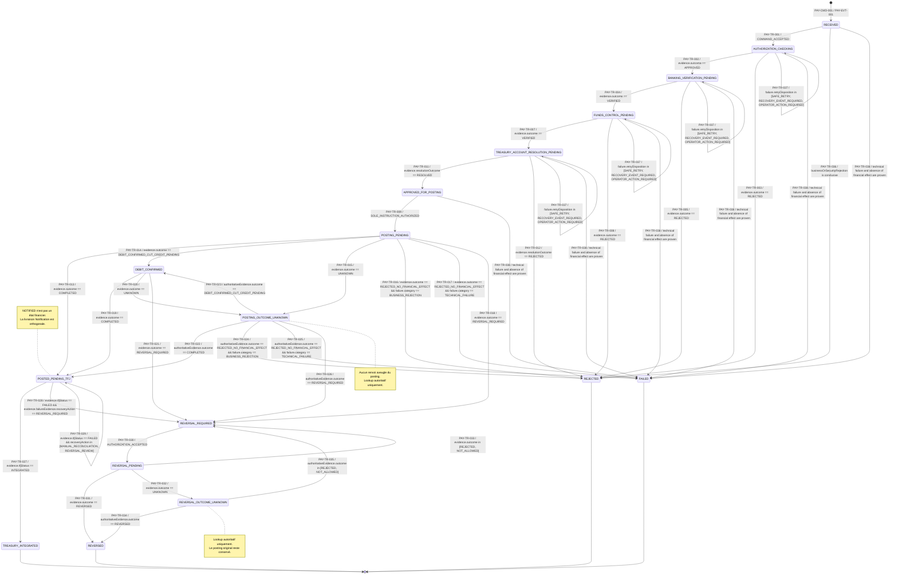

# SIXPAY CONNECT — Machine à états normative Payment

> **Lot:** `4 — Machine à états normative`  
> **Branche:** `feat/payment-domain-generation-brief`  
> **Statut:** `IMPLEMENTED`  
> **Source machine:** `PAYMENT_STATE_MACHINE.yaml`

## 1. Arbitrages normatifs

La liste initiale a été raffinée sans modifier le noyau déjà validé :

| Proposition initiale | État normatif retenu | Décision |
| --- | --- | --- |
| `BANKING_CHECKING` | `BANKING_VERIFICATION_PENDING` puis `FUNDS_CONTROL_PENDING` | Séparation de la vérification d’identité/compte et du contrôle de fonds. |
| `APPROVED` | `APPROVED_FOR_POSTING` | L’autorisation métier complète précède l’unique instruction de posting. |
| `POSTING` | `POSTING_PENDING` | L’instruction unique est durable et peut avoir atteint Amplitude. |
| résultat incertain | `POSTING_OUTCOME_UNKNOWN` | Option explicite retenue; aucun rejeu financier aveugle. |
| `DEBITED` | `DEBIT_CONFIRMED` | Débit confirmé, crédit CUT non encore confirmé. |
| `CUT_CREDITED` | `POSTED_PENDING_TFJ` | Débit et crédit CUT confirmés; finalité TFJ encore absente. |
| `PENDING_END_OF_DAY_CONFIRMATION` | `POSTED_PENDING_TFJ` | Nom canonique unique pour l’attente TFJ. |
| `NOTIFIED` | Aucun état Payment | Notification est orthogonale; sa livraison ne modifie jamais l’état financier. |
| reversal échoué/incertain | `REVERSAL_OUTCOME_UNKNOWN` ou `REVERSAL_REQUIRED` | Le posting original et ses références restent conservés. |

## 2. Comptes normatifs

```text
États                    : 17
États terminaux          : 4
Commandes                : 16
Opérations Aggregate     : 17
Transitions              : 38
Domain Events            : 33
```

## 3. Diagramme Mermaid exhaustif



## 4. Table exhaustive des transitions

| ID | État source | Commande | Opération | Préconditions | Résultat externe nécessaire | État cible | Domain Event(s) | Événement d’intégration éventuel | Audit attendu | Transition invalide | Rejeu | Effet financier | Terminalité |
| --- | --- | --- | --- | --- | --- | --- | --- | --- | --- | --- | --- | --- | --- |
| `PAY-TR-001` | `RECEIVED` | `PAY-CMD-002` `StartAuthorizationCheckingCommand` | `PAY-OP-002` `startAuthorizationChecking` | `PAY-INV-010` businessVersion is non-negative and increases exactly once for each successful state-changing mutation; no-op replay and rejected operations do not increase it.<br>`PAY-INV-021` Banking verification cannot begin before Payment has accepted an AuthorizationEvidenceSnapshot with outcome APPROVED. | Aucun résultat externe supplémentaire. | `AUTHORIZATION_CHECKING` | `PAY-EVT-002` `PaymentAuthorizationCheckingStarted` | `PaymentAuthorizationCheckingStarted` → consommateurs candidats: integration, reporting, security; contrat versionné différé à la couche `events`. | audit de transition avec PaymentId, état source/cible, version résultante et correlationId. | `PAYMENT_INVALID_TRANSITION` sans mutation/version/événement | `IDENTICAL_COMMAND_NO_OP` | Aucun effet financier possible. | Non terminal |
| `PAY-TR-002` | `AUTHORIZATION_CHECKING` | `PAY-CMD-003` `ApplyAuthorizationDecisionCommand` | `PAY-OP-003` `recordAuthorizationDecision` | `PAY-INV-021` Banking verification cannot begin before Payment has accepted an AuthorizationEvidenceSnapshot with outcome APPROVED.<br>`PAY-INV-022` An approved authorization snapshot requires every mandatory request binding to MATCH, a valid payment scope and acceptance inside the approved validity interval. | evidence.outcome == APPROVED | `BANKING_VERIFICATION_PENDING` | `PAY-EVT-003` `PaymentAuthorizationDecisionRecorded`<br>`PAY-EVT-004` `PaymentBankingVerificationRequested` | `PaymentAuthorizationDecisionRecorded` → consommateurs candidats: reporting; contrat versionné différé à la couche `events`.<br>`PaymentBankingVerificationRequested` → consommateurs candidats: customer, reporting; contrat versionné différé à la couche `events`. | audit de transition avec PaymentId, état source/cible, version résultante et correlationId; fingerprint et identité sûre de la preuve acceptée. | `PAYMENT_INVALID_TRANSITION` sans mutation/version/événement | `IDENTICAL_EVIDENCE_NO_OP` | Aucun effet financier possible. | Non terminal |
| `PAY-TR-003` | `AUTHORIZATION_CHECKING` | `PAY-CMD-003` `ApplyAuthorizationDecisionCommand` | `PAY-OP-003` `recordAuthorizationDecision` | `PAY-INV-023` A rejected authorization snapshot forbids all Amplitude customer, funds and posting operations for that Payment.<br>`PAY-INV-065` FAILED is terminal only when absence of financial effect is proven; an uncertain, partial or reversal-required Payment cannot become FAILED. | evidence.outcome == REJECTED | `REJECTED` | `PAY-EVT-003` `PaymentAuthorizationDecisionRecorded`<br>`PAY-EVT-005` `PaymentRejected`<br>`PAY-EVT-006` `PaymentImmediateResultAvailable` | `PaymentAuthorizationDecisionRecorded` → consommateurs candidats: reporting; contrat versionné différé à la couche `events`.<br>`PaymentRejected` → consommateurs candidats: customer, reporting; contrat versionné différé à la couche `events`.<br>`PaymentImmediateResultAvailable` → consommateurs candidats: notification, reporting; contrat versionné différé à la couche `events`. | audit de transition avec PaymentId, état source/cible, version résultante et correlationId; fingerprint et identité sûre de la preuve acceptée; code d’échec sûr, catégorie, étape et disposition de reprise. | `PAYMENT_INVALID_TRANSITION` sans mutation/version/événement | `TERMINAL_IDENTICAL_REPLAY_NO_OP` | Aucun effet financier possible. | Terminal |
| `PAY-TR-004` | `BANKING_VERIFICATION_PENDING` | `PAY-CMD-004` `ApplyBankingVerificationCommand` | `PAY-OP-004` `recordBankingVerification` | `PAY-INV-027` BankingVerificationSnapshot and FundsControlSnapshot are distinct evidence categories and neither substitutes for the other.<br>`PAY-INV-028` Only a BankingVerificationSnapshot with outcome VERIFIED may permit progression to funds control.<br>`PAY-INV-030` Every accepted banking verification must match the aggregate institution and debtor-account binding fingerprint. | evidence.outcome == VERIFIED | `FUNDS_CONTROL_PENDING` | `PAY-EVT-007` `PaymentBankingVerificationRecorded`<br>`PAY-EVT-008` `PaymentFundsControlRequested` | `PaymentBankingVerificationRecorded` → consommateurs candidats: customer, reporting; contrat versionné différé à la couche `events`.<br>`PaymentFundsControlRequested` → consommateurs candidats: accounting, reporting; contrat versionné différé à la couche `events`. | audit de transition avec PaymentId, état source/cible, version résultante et correlationId; fingerprint et identité sûre de la preuve acceptée. | `PAYMENT_INVALID_TRANSITION` sans mutation/version/événement | `IDENTICAL_EVIDENCE_NO_OP` | Aucun effet financier possible. | Non terminal |
| `PAY-TR-005` | `BANKING_VERIFICATION_PENDING` | `PAY-CMD-004` `ApplyBankingVerificationCommand` | `PAY-OP-004` `recordBankingVerification` | `PAY-INV-029` A banking verification outcome REJECTED produces a definitive business rejection before financial submission; INDETERMINATE never permits approval.<br>`PAY-INV-065` FAILED is terminal only when absence of financial effect is proven; an uncertain, partial or reversal-required Payment cannot become FAILED. | evidence.outcome == REJECTED | `REJECTED` | `PAY-EVT-007` `PaymentBankingVerificationRecorded`<br>`PAY-EVT-005` `PaymentRejected`<br>`PAY-EVT-006` `PaymentImmediateResultAvailable` | `PaymentBankingVerificationRecorded` → consommateurs candidats: customer, reporting; contrat versionné différé à la couche `events`.<br>`PaymentRejected` → consommateurs candidats: customer, reporting; contrat versionné différé à la couche `events`.<br>`PaymentImmediateResultAvailable` → consommateurs candidats: notification, reporting; contrat versionné différé à la couche `events`. | audit de transition avec PaymentId, état source/cible, version résultante et correlationId; fingerprint et identité sûre de la preuve acceptée; code d’échec sûr, catégorie, étape et disposition de reprise. | `PAYMENT_INVALID_TRANSITION` sans mutation/version/événement | `TERMINAL_IDENTICAL_REPLAY_NO_OP` | Aucun effet financier possible. | Terminal |
| `PAY-TR-006` | `BANKING_VERIFICATION_PENDING` | `PAY-CMD-004` `ApplyBankingVerificationCommand` | `PAY-OP-004` `recordBankingVerification` | `PAY-INV-029` A banking verification outcome REJECTED produces a definitive business rejection before financial submission; INDETERMINATE never permits approval.<br>`PAY-INV-068` Same source/reference or idempotency scope with a different canonical request fingerprint is a conflict and leaves the original Payment unchanged. | evidence.outcome == INDETERMINATE | `BANKING_VERIFICATION_PENDING` | `PAY-EVT-007` `PaymentBankingVerificationRecorded`<br>`PAY-EVT-009` `PaymentProcessingDeferred`<br>`PAY-EVT-006` `PaymentImmediateResultAvailable` | `PaymentBankingVerificationRecorded` → consommateurs candidats: customer, reporting; contrat versionné différé à la couche `events`.<br>`PaymentProcessingDeferred` → consommateurs candidats: reporting; contrat versionné différé à la couche `events`.<br>`PaymentImmediateResultAvailable` → consommateurs candidats: notification, reporting; contrat versionné différé à la couche `events`. | audit de transition avec PaymentId, état source/cible, version résultante et correlationId; fingerprint et identité sûre de la preuve acceptée. | `PAYMENT_INVALID_TRANSITION` sans mutation/version/événement | `IDENTICAL_EVIDENCE_NO_OP` | Aucun effet financier possible. | Non terminal |
| `PAY-TR-007` | `FUNDS_CONTROL_PENDING` | `PAY-CMD-005` `ApplyFundsControlCommand` | `PAY-OP-005` `recordFundsControl` | `PAY-INV-032` Only a FundsControlSnapshot with outcome VERIFIED, exact Payment amount/account binding and unexpired validity may authorize posting.<br>`PAY-INV-034` Available balance and provider-disclosed available amount are never retained in Payment. | evidence.outcome == VERIFIED | `TREASURY_ACCOUNT_RESOLUTION_PENDING` | `PAY-EVT-010` `PaymentFundsControlRecorded`<br>`PAY-EVT-011` `PaymentTreasuryAccountResolutionRequested` | `PaymentFundsControlRecorded` → consommateurs candidats: reporting; contrat versionné différé à la couche `events`.<br>`PaymentTreasuryAccountResolutionRequested` → consommateurs candidats: accounting, reporting; contrat versionné différé à la couche `events`. | audit de transition avec PaymentId, état source/cible, version résultante et correlationId; fingerprint et identité sûre de la preuve acceptée. | `PAYMENT_INVALID_TRANSITION` sans mutation/version/événement | `IDENTICAL_EVIDENCE_NO_OP` | Aucun effet financier possible. | Non terminal |
| `PAY-TR-008` | `FUNDS_CONTROL_PENDING` | `PAY-CMD-005` `ApplyFundsControlCommand` | `PAY-OP-005` `recordFundsControl` | `PAY-INV-033` Funds outcome REJECTED forbids posting and supports business rejection; INDETERMINATE supports only controlled recovery or technical failure.<br>`PAY-INV-065` FAILED is terminal only when absence of financial effect is proven; an uncertain, partial or reversal-required Payment cannot become FAILED. | evidence.outcome == REJECTED | `REJECTED` | `PAY-EVT-010` `PaymentFundsControlRecorded`<br>`PAY-EVT-005` `PaymentRejected`<br>`PAY-EVT-006` `PaymentImmediateResultAvailable` | `PaymentFundsControlRecorded` → consommateurs candidats: reporting; contrat versionné différé à la couche `events`.<br>`PaymentRejected` → consommateurs candidats: customer, reporting; contrat versionné différé à la couche `events`.<br>`PaymentImmediateResultAvailable` → consommateurs candidats: notification, reporting; contrat versionné différé à la couche `events`. | audit de transition avec PaymentId, état source/cible, version résultante et correlationId; fingerprint et identité sûre de la preuve acceptée; code d’échec sûr, catégorie, étape et disposition de reprise. | `PAYMENT_INVALID_TRANSITION` sans mutation/version/événement | `TERMINAL_IDENTICAL_REPLAY_NO_OP` | Aucun effet financier possible. | Terminal |
| `PAY-TR-009` | `APPROVED_FOR_POSTING` | `PAY-CMD-007` `AuthorizePostingCommand` | `PAY-OP-007` `authorizePosting` | `PAY-INV-038` A Payment is approved for financial submission only when authorization, banking verification, funds control and Treasury resolution are all favorable and mutually coherent.<br>`PAY-INV-039` One Payment authorizes at most one logical posting instruction for its original payment intention.<br>`PAY-INV-040` Every retry of the same posting instruction reuses the exact posting idempotency key and immutable instruction fingerprint; a new key is not a retry.<br>`PAY-INV-041` A posting outcome must match the original Payment reference, amount, institution, debtor account, Treasury reference and posting command identity. | Aucun résultat externe supplémentaire. | `POSTING_PENDING` | `PAY-EVT-014` `PaymentPostingAuthorized`<br>`PAY-EVT-015` `PaymentPostingRequested` | `PaymentPostingAuthorized` → consommateurs candidats: reporting; contrat versionné différé à la couche `events`.<br>`PaymentPostingRequested` → consommateurs candidats: accounting, reporting; contrat versionné différé à la couche `events`. | audit de transition avec PaymentId, état source/cible, version résultante et correlationId. | `PAYMENT_INVALID_TRANSITION` sans mutation/version/événement | `SAME_INSTRUCTION_NO_OP_DIFFERENT_INSTRUCTION_CONFLICT` | La transition ouvre ou constate une zone où un effet financier est possible. | Non terminal |
| `PAY-TR-010` | `FUNDS_CONTROL_PENDING` | `PAY-CMD-005` `ApplyFundsControlCommand` | `PAY-OP-005` `recordFundsControl` | `PAY-INV-033` Funds outcome REJECTED forbids posting and supports business rejection; INDETERMINATE supports only controlled recovery or technical failure.<br>`PAY-INV-068` Same source/reference or idempotency scope with a different canonical request fingerprint is a conflict and leaves the original Payment unchanged. | evidence.outcome == INDETERMINATE | `FUNDS_CONTROL_PENDING` | `PAY-EVT-010` `PaymentFundsControlRecorded`<br>`PAY-EVT-009` `PaymentProcessingDeferred`<br>`PAY-EVT-006` `PaymentImmediateResultAvailable` | `PaymentFundsControlRecorded` → consommateurs candidats: reporting; contrat versionné différé à la couche `events`.<br>`PaymentProcessingDeferred` → consommateurs candidats: reporting; contrat versionné différé à la couche `events`.<br>`PaymentImmediateResultAvailable` → consommateurs candidats: notification, reporting; contrat versionné différé à la couche `events`. | audit de transition avec PaymentId, état source/cible, version résultante et correlationId; fingerprint et identité sûre de la preuve acceptée. | `PAYMENT_INVALID_TRANSITION` sans mutation/version/événement | `IDENTICAL_EVIDENCE_NO_OP` | Aucun effet financier possible. | Non terminal |
| `PAY-TR-011` | `TREASURY_ACCOUNT_RESOLUTION_PENDING` | `PAY-CMD-006` `ApplyTreasuryAccountResolutionCommand` | `PAY-OP-006` `recordTreasuryAccountResolution` | `PAY-INV-035` Posting authorization requires a TreasuryAccountResolutionSnapshot with outcome RESOLVED and a TreasuryAccountReference produced from protected bank configuration.<br>`PAY-INV-036` Resolved Treasury institution and allocation-intent fingerprint must match the Payment; inbound beneficiary/account data cannot create or override the CUT reference.<br>`PAY-INV-038` A Payment is approved for financial submission only when authorization, banking verification, funds control and Treasury resolution are all favorable and mutually coherent. | evidence.resolutionOutcome == RESOLVED | `APPROVED_FOR_POSTING` | `PAY-EVT-012` `PaymentTreasuryAccountResolutionRecorded`<br>`PAY-EVT-013` `PaymentApprovedForPosting` | `PaymentTreasuryAccountResolutionRecorded` → consommateurs candidats: reporting; contrat versionné différé à la couche `events`.<br>`PaymentApprovedForPosting` → consommateurs candidats: reporting; contrat versionné différé à la couche `events`. | audit de transition avec PaymentId, état source/cible, version résultante et correlationId; fingerprint et identité sûre de la preuve acceptée. | `PAYMENT_INVALID_TRANSITION` sans mutation/version/événement | `IDENTICAL_EVIDENCE_NO_OP` | Aucun effet financier possible. | Non terminal |
| `PAY-TR-012` | `TREASURY_ACCOUNT_RESOLUTION_PENDING` | `PAY-CMD-006` `ApplyTreasuryAccountResolutionCommand` | `PAY-OP-006` `recordTreasuryAccountResolution` | `PAY-INV-035` Posting authorization requires a TreasuryAccountResolutionSnapshot with outcome RESOLVED and a TreasuryAccountReference produced from protected bank configuration.<br>`PAY-INV-065` FAILED is terminal only when absence of financial effect is proven; an uncertain, partial or reversal-required Payment cannot become FAILED. | evidence.resolutionOutcome == REJECTED | `REJECTED` | `PAY-EVT-012` `PaymentTreasuryAccountResolutionRecorded`<br>`PAY-EVT-005` `PaymentRejected`<br>`PAY-EVT-006` `PaymentImmediateResultAvailable` | `PaymentTreasuryAccountResolutionRecorded` → consommateurs candidats: reporting; contrat versionné différé à la couche `events`.<br>`PaymentRejected` → consommateurs candidats: customer, reporting; contrat versionné différé à la couche `events`.<br>`PaymentImmediateResultAvailable` → consommateurs candidats: notification, reporting; contrat versionné différé à la couche `events`. | audit de transition avec PaymentId, état source/cible, version résultante et correlationId; fingerprint et identité sûre de la preuve acceptée; code d’échec sûr, catégorie, étape et disposition de reprise. | `PAYMENT_INVALID_TRANSITION` sans mutation/version/événement | `TERMINAL_IDENTICAL_REPLAY_NO_OP` | Aucun effet financier possible. | Terminal |
| `PAY-TR-013` | `POSTING_PENDING` | `PAY-CMD-008` `ApplyPostingOutcomeCommand` | `PAY-OP-008` `recordPostingOutcome` | `PAY-INV-041` A posting outcome must match the original Payment reference, amount, institution, debtor account, Treasury reference and posting command identity.<br>`PAY-INV-044` Posting outcome COMPLETED requires debit SUCCEEDED, CUT credit SUCCEEDED, exact Money and a principal BankPostingReference.<br>`PAY-INV-049` Confirmed debit and CUT credit establish immediate posting facts only; they never establish TFJ finality.<br>`PAY-INV-050` A posting or posting-resolution mutation is committed atomically with aggregate state, immutable audit and Outbox intent, or none of them is committed. | evidence.outcome == COMPLETED | `POSTED_PENDING_TFJ` | `PAY-EVT-016` `PaymentPostingOutcomeRecorded`<br>`PAY-EVT-006` `PaymentImmediateResultAvailable`<br>`PAY-EVT-017` `PaymentEndOfDayTrackingRequested` | `PaymentPostingOutcomeRecorded` → consommateurs candidats: accounting, reporting; contrat versionné différé à la couche `events`.<br>`PaymentImmediateResultAvailable` → consommateurs candidats: notification, reporting; contrat versionné différé à la couche `events`.<br>`PaymentEndOfDayTrackingRequested` → consommateurs candidats: accounting, reporting; contrat versionné différé à la couche `events`. | audit de transition avec PaymentId, état source/cible, version résultante et correlationId; fingerprint et identité sûre de la preuve acceptée. | `PAYMENT_INVALID_TRANSITION` sans mutation/version/événement | `IDENTICAL_EVIDENCE_NO_OP` | Effet financier possible ou déjà confirmé; conservation des preuves obligatoire. | Non terminal |
| `PAY-TR-014` | `POSTING_PENDING` | `PAY-CMD-008` `ApplyPostingOutcomeCommand` | `PAY-OP-008` `recordPostingOutcome` | `PAY-INV-045` DEBIT_CONFIRMED_CUT_CREDIT_PENDING requires debit SUCCEEDED, CUT credit PENDING or UNKNOWN, a principal posting reference and no success finalization.<br>`PAY-INV-048` The original BankPostingReference is retained for the lifetime of Payment, including after TFJ processing or reversal. | evidence.outcome == DEBIT_CONFIRMED_CUT_CREDIT_PENDING | `DEBIT_CONFIRMED` | `PAY-EVT-016` `PaymentPostingOutcomeRecorded`<br>`PAY-EVT-018` `PaymentDebitConfirmed`<br>`PAY-EVT-006` `PaymentImmediateResultAvailable` | `PaymentPostingOutcomeRecorded` → consommateurs candidats: accounting, reporting; contrat versionné différé à la couche `events`.<br>`PaymentDebitConfirmed` → consommateurs candidats: accounting, reporting; contrat versionné différé à la couche `events`.<br>`PaymentImmediateResultAvailable` → consommateurs candidats: notification, reporting; contrat versionné différé à la couche `events`. | audit de transition avec PaymentId, état source/cible, version résultante et correlationId; fingerprint et identité sûre de la preuve acceptée. | `PAYMENT_INVALID_TRANSITION` sans mutation/version/événement | `IDENTICAL_EVIDENCE_NO_OP` | Effet financier possible ou déjà confirmé; conservation des preuves obligatoire. | Non terminal |
| `PAY-TR-015` | `POSTING_PENDING` | `PAY-CMD-008` `ApplyPostingOutcomeCommand` | `PAY-OP-008` `recordPostingOutcome` | `PAY-INV-042` Posting outcome UNKNOWN means neither success nor failure, forbids blind financial resubmission and requires authoritative lookup or reconciliation.<br>`PAY-INV-069` Same evidence identity and fingerprint is a no-op without version increment or new domain event; same identity with another fingerprint is a conflict. | evidence.outcome == UNKNOWN | `POSTING_OUTCOME_UNKNOWN` | `PAY-EVT-016` `PaymentPostingOutcomeRecorded`<br>`PAY-EVT-019` `PaymentPostingOutcomeLookupRequested`<br>`PAY-EVT-006` `PaymentImmediateResultAvailable` | `PaymentPostingOutcomeRecorded` → consommateurs candidats: accounting, reporting; contrat versionné différé à la couche `events`.<br>`PaymentPostingOutcomeLookupRequested` → consommateurs candidats: accounting, reporting; contrat versionné différé à la couche `events`.<br>`PaymentImmediateResultAvailable` → consommateurs candidats: notification, reporting; contrat versionné différé à la couche `events`. | audit de transition avec PaymentId, état source/cible, version résultante et correlationId; fingerprint et identité sûre de la preuve acceptée. | `PAYMENT_INVALID_TRANSITION` sans mutation/version/événement | `IDENTICAL_EVIDENCE_NO_OP` | Effet financier possible ou déjà confirmé; conservation des preuves obligatoire. | Non terminal |
| `PAY-TR-016` | `POSTING_PENDING` | `PAY-CMD-008` `ApplyPostingOutcomeCommand` | `PAY-OP-008` `recordPostingOutcome` | `PAY-INV-043` A posting may be classified REJECTED_NO_FINANCIAL_EFFECT or Payment FAILED only when authoritative evidence proves that neither debit nor CUT credit occurred.<br>`PAY-INV-065` FAILED is terminal only when absence of financial effect is proven; an uncertain, partial or reversal-required Payment cannot become FAILED. | evidence.outcome == REJECTED_NO_FINANCIAL_EFFECT && failure.category == BUSINESS_REJECTION | `REJECTED` | `PAY-EVT-016` `PaymentPostingOutcomeRecorded`<br>`PAY-EVT-005` `PaymentRejected`<br>`PAY-EVT-006` `PaymentImmediateResultAvailable` | `PaymentPostingOutcomeRecorded` → consommateurs candidats: accounting, reporting; contrat versionné différé à la couche `events`.<br>`PaymentRejected` → consommateurs candidats: customer, reporting; contrat versionné différé à la couche `events`.<br>`PaymentImmediateResultAvailable` → consommateurs candidats: notification, reporting; contrat versionné différé à la couche `events`. | audit de transition avec PaymentId, état source/cible, version résultante et correlationId; fingerprint et identité sûre de la preuve acceptée; code d’échec sûr, catégorie, étape et disposition de reprise. | `PAYMENT_INVALID_TRANSITION` sans mutation/version/événement | `TERMINAL_IDENTICAL_REPLAY_NO_OP` | Sortie financière seulement avec absence d’effet prouvée. | Terminal |
| `PAY-TR-017` | `POSTING_PENDING` | `PAY-CMD-008` `ApplyPostingOutcomeCommand` | `PAY-OP-008` `recordPostingOutcome` | `PAY-INV-043` A posting may be classified REJECTED_NO_FINANCIAL_EFFECT or Payment FAILED only when authoritative evidence proves that neither debit nor CUT credit occurred.<br>`PAY-INV-066` Every terminal state has finalizedAt, immutable terminal evidence and no later state-changing command; an identical fact replay remains a no-op. | evidence.outcome == REJECTED_NO_FINANCIAL_EFFECT && failure.category == TECHNICAL_FAILURE | `FAILED` | `PAY-EVT-016` `PaymentPostingOutcomeRecorded`<br>`PAY-EVT-032` `PaymentFailedWithoutFinancialEffect`<br>`PAY-EVT-006` `PaymentImmediateResultAvailable` | `PaymentPostingOutcomeRecorded` → consommateurs candidats: accounting, reporting; contrat versionné différé à la couche `events`.<br>`PaymentFailedWithoutFinancialEffect` → consommateurs candidats: customer, reporting; contrat versionné différé à la couche `events`.<br>`PaymentImmediateResultAvailable` → consommateurs candidats: notification, reporting; contrat versionné différé à la couche `events`. | audit de transition avec PaymentId, état source/cible, version résultante et correlationId; fingerprint et identité sûre de la preuve acceptée; code d’échec sûr, catégorie, étape et disposition de reprise. | `PAYMENT_INVALID_TRANSITION` sans mutation/version/événement | `TERMINAL_IDENTICAL_REPLAY_NO_OP` | Sortie financière seulement avec absence d’effet prouvée. | Terminal |
| `PAY-TR-018` | `POSTING_PENDING` | `PAY-CMD-008` `ApplyPostingOutcomeCommand` | `PAY-OP-008` `recordPostingOutcome` | `PAY-INV-046` A confirmed debit with explicit CUT-credit failure requires reversal review/authorization and can never be represented as successful or failed-without-effect.<br>`PAY-INV-047` When principal or leg references are present in multiple domain objects, they must be equal and immutable. | evidence.outcome == REVERSAL_REQUIRED | `REVERSAL_REQUIRED` | `PAY-EVT-016` `PaymentPostingOutcomeRecorded`<br>`PAY-EVT-020` `PaymentReversalRequired`<br>`PAY-EVT-006` `PaymentImmediateResultAvailable` | `PaymentPostingOutcomeRecorded` → consommateurs candidats: accounting, reporting; contrat versionné différé à la couche `events`.<br>`PaymentReversalRequired` → consommateurs candidats: accounting, reporting; contrat versionné différé à la couche `events`.<br>`PaymentImmediateResultAvailable` → consommateurs candidats: notification, reporting; contrat versionné différé à la couche `events`. | audit de transition avec PaymentId, état source/cible, version résultante et correlationId; fingerprint et identité sûre de la preuve acceptée; code d’échec sûr, catégorie, étape et disposition de reprise. | `PAYMENT_INVALID_TRANSITION` sans mutation/version/événement | `IDENTICAL_EVIDENCE_NO_OP` | Effet financier possible ou déjà confirmé; conservation des preuves obligatoire. | Non terminal |
| `PAY-TR-019` | `DEBIT_CONFIRMED` | `PAY-CMD-008` `ApplyPostingOutcomeCommand` | `PAY-OP-008` `recordPostingOutcome` | `PAY-INV-044` Posting outcome COMPLETED requires debit SUCCEEDED, CUT credit SUCCEEDED, exact Money and a principal BankPostingReference.<br>`PAY-INV-049` Confirmed debit and CUT credit establish immediate posting facts only; they never establish TFJ finality.<br>`PAY-INV-050` A posting or posting-resolution mutation is committed atomically with aggregate state, immutable audit and Outbox intent, or none of them is committed. | evidence.outcome == COMPLETED | `POSTED_PENDING_TFJ` | `PAY-EVT-016` `PaymentPostingOutcomeRecorded`<br>`PAY-EVT-006` `PaymentImmediateResultAvailable`<br>`PAY-EVT-017` `PaymentEndOfDayTrackingRequested` | `PaymentPostingOutcomeRecorded` → consommateurs candidats: accounting, reporting; contrat versionné différé à la couche `events`.<br>`PaymentImmediateResultAvailable` → consommateurs candidats: notification, reporting; contrat versionné différé à la couche `events`.<br>`PaymentEndOfDayTrackingRequested` → consommateurs candidats: accounting, reporting; contrat versionné différé à la couche `events`. | audit de transition avec PaymentId, état source/cible, version résultante et correlationId; fingerprint et identité sûre de la preuve acceptée. | `PAYMENT_INVALID_TRANSITION` sans mutation/version/événement | `IDENTICAL_EVIDENCE_NO_OP` | Effet financier possible ou déjà confirmé; conservation des preuves obligatoire. | Non terminal |
| `PAY-TR-020` | `DEBIT_CONFIRMED` | `PAY-CMD-008` `ApplyPostingOutcomeCommand` | `PAY-OP-008` `recordPostingOutcome` | `PAY-INV-042` Posting outcome UNKNOWN means neither success nor failure, forbids blind financial resubmission and requires authoritative lookup or reconciliation.<br>`PAY-INV-045` DEBIT_CONFIRMED_CUT_CREDIT_PENDING requires debit SUCCEEDED, CUT credit PENDING or UNKNOWN, a principal posting reference and no success finalization. | evidence.outcome == UNKNOWN | `POSTING_OUTCOME_UNKNOWN` | `PAY-EVT-016` `PaymentPostingOutcomeRecorded`<br>`PAY-EVT-019` `PaymentPostingOutcomeLookupRequested`<br>`PAY-EVT-006` `PaymentImmediateResultAvailable` | `PaymentPostingOutcomeRecorded` → consommateurs candidats: accounting, reporting; contrat versionné différé à la couche `events`.<br>`PaymentPostingOutcomeLookupRequested` → consommateurs candidats: accounting, reporting; contrat versionné différé à la couche `events`.<br>`PaymentImmediateResultAvailable` → consommateurs candidats: notification, reporting; contrat versionné différé à la couche `events`. | audit de transition avec PaymentId, état source/cible, version résultante et correlationId; fingerprint et identité sûre de la preuve acceptée. | `PAYMENT_INVALID_TRANSITION` sans mutation/version/événement | `IDENTICAL_EVIDENCE_NO_OP` | Effet financier possible ou déjà confirmé; conservation des preuves obligatoire. | Non terminal |
| `PAY-TR-021` | `DEBIT_CONFIRMED` | `PAY-CMD-008` `ApplyPostingOutcomeCommand` | `PAY-OP-008` `recordPostingOutcome` | `PAY-INV-046` A confirmed debit with explicit CUT-credit failure requires reversal review/authorization and can never be represented as successful or failed-without-effect.<br>`PAY-INV-047` When principal or leg references are present in multiple domain objects, they must be equal and immutable. | evidence.outcome == REVERSAL_REQUIRED | `REVERSAL_REQUIRED` | `PAY-EVT-016` `PaymentPostingOutcomeRecorded`<br>`PAY-EVT-020` `PaymentReversalRequired`<br>`PAY-EVT-006` `PaymentImmediateResultAvailable` | `PaymentPostingOutcomeRecorded` → consommateurs candidats: accounting, reporting; contrat versionné différé à la couche `events`.<br>`PaymentReversalRequired` → consommateurs candidats: accounting, reporting; contrat versionné différé à la couche `events`.<br>`PaymentImmediateResultAvailable` → consommateurs candidats: notification, reporting; contrat versionné différé à la couche `events`. | audit de transition avec PaymentId, état source/cible, version résultante et correlationId; fingerprint et identité sûre de la preuve acceptée; code d’échec sûr, catégorie, étape et disposition de reprise. | `PAYMENT_INVALID_TRANSITION` sans mutation/version/événement | `IDENTICAL_EVIDENCE_NO_OP` | Effet financier possible ou déjà confirmé; conservation des preuves obligatoire. | Non terminal |
| `PAY-TR-022` | `POSTING_OUTCOME_UNKNOWN` | `PAY-CMD-009` `ResolvePostingOutcomeCommand` | `PAY-OP-009` `resolvePostingOutcome` | `PAY-INV-042` Posting outcome UNKNOWN means neither success nor failure, forbids blind financial resubmission and requires authoritative lookup or reconciliation.<br>`PAY-INV-044` Posting outcome COMPLETED requires debit SUCCEEDED, CUT credit SUCCEEDED, exact Money and a principal BankPostingReference.<br>`PAY-INV-050` A posting or posting-resolution mutation is committed atomically with aggregate state, immutable audit and Outbox intent, or none of them is committed. | authoritativeEvidence.outcome == COMPLETED | `POSTED_PENDING_TFJ` | `PAY-EVT-021` `PaymentPostingOutcomeResolved`<br>`PAY-EVT-006` `PaymentImmediateResultAvailable`<br>`PAY-EVT-017` `PaymentEndOfDayTrackingRequested` | `PaymentPostingOutcomeResolved` → consommateurs candidats: accounting, reporting; contrat versionné différé à la couche `events`.<br>`PaymentImmediateResultAvailable` → consommateurs candidats: notification, reporting; contrat versionné différé à la couche `events`.<br>`PaymentEndOfDayTrackingRequested` → consommateurs candidats: accounting, reporting; contrat versionné différé à la couche `events`. | audit de transition avec PaymentId, état source/cible, version résultante et correlationId; fingerprint et identité sûre de la preuve acceptée. | `PAYMENT_INVALID_TRANSITION` sans mutation/version/événement | `IDENTICAL_EVIDENCE_NO_OP` | Effet financier possible ou déjà confirmé; conservation des preuves obligatoire. | Non terminal |
| `PAY-TR-023` | `POSTING_OUTCOME_UNKNOWN` | `PAY-CMD-009` `ResolvePostingOutcomeCommand` | `PAY-OP-009` `resolvePostingOutcome` | `PAY-INV-042` Posting outcome UNKNOWN means neither success nor failure, forbids blind financial resubmission and requires authoritative lookup or reconciliation.<br>`PAY-INV-045` DEBIT_CONFIRMED_CUT_CREDIT_PENDING requires debit SUCCEEDED, CUT credit PENDING or UNKNOWN, a principal posting reference and no success finalization. | authoritativeEvidence.outcome == DEBIT_CONFIRMED_CUT_CREDIT_PENDING | `DEBIT_CONFIRMED` | `PAY-EVT-021` `PaymentPostingOutcomeResolved`<br>`PAY-EVT-018` `PaymentDebitConfirmed`<br>`PAY-EVT-006` `PaymentImmediateResultAvailable` | `PaymentPostingOutcomeResolved` → consommateurs candidats: accounting, reporting; contrat versionné différé à la couche `events`.<br>`PaymentDebitConfirmed` → consommateurs candidats: accounting, reporting; contrat versionné différé à la couche `events`.<br>`PaymentImmediateResultAvailable` → consommateurs candidats: notification, reporting; contrat versionné différé à la couche `events`. | audit de transition avec PaymentId, état source/cible, version résultante et correlationId; fingerprint et identité sûre de la preuve acceptée. | `PAYMENT_INVALID_TRANSITION` sans mutation/version/événement | `IDENTICAL_EVIDENCE_NO_OP` | Effet financier possible ou déjà confirmé; conservation des preuves obligatoire. | Non terminal |
| `PAY-TR-024` | `POSTING_OUTCOME_UNKNOWN` | `PAY-CMD-009` `ResolvePostingOutcomeCommand` | `PAY-OP-009` `resolvePostingOutcome` | `PAY-INV-043` A posting may be classified REJECTED_NO_FINANCIAL_EFFECT or Payment FAILED only when authoritative evidence proves that neither debit nor CUT credit occurred.<br>`PAY-INV-065` FAILED is terminal only when absence of financial effect is proven; an uncertain, partial or reversal-required Payment cannot become FAILED. | authoritativeEvidence.outcome == REJECTED_NO_FINANCIAL_EFFECT && failure.category == BUSINESS_REJECTION | `REJECTED` | `PAY-EVT-021` `PaymentPostingOutcomeResolved`<br>`PAY-EVT-005` `PaymentRejected`<br>`PAY-EVT-006` `PaymentImmediateResultAvailable` | `PaymentPostingOutcomeResolved` → consommateurs candidats: accounting, reporting; contrat versionné différé à la couche `events`.<br>`PaymentRejected` → consommateurs candidats: customer, reporting; contrat versionné différé à la couche `events`.<br>`PaymentImmediateResultAvailable` → consommateurs candidats: notification, reporting; contrat versionné différé à la couche `events`. | audit de transition avec PaymentId, état source/cible, version résultante et correlationId; fingerprint et identité sûre de la preuve acceptée; code d’échec sûr, catégorie, étape et disposition de reprise. | `PAYMENT_INVALID_TRANSITION` sans mutation/version/événement | `TERMINAL_IDENTICAL_REPLAY_NO_OP` | Sortie financière seulement avec absence d’effet prouvée. | Terminal |
| `PAY-TR-025` | `POSTING_OUTCOME_UNKNOWN` | `PAY-CMD-009` `ResolvePostingOutcomeCommand` | `PAY-OP-009` `resolvePostingOutcome` | `PAY-INV-043` A posting may be classified REJECTED_NO_FINANCIAL_EFFECT or Payment FAILED only when authoritative evidence proves that neither debit nor CUT credit occurred.<br>`PAY-INV-066` Every terminal state has finalizedAt, immutable terminal evidence and no later state-changing command; an identical fact replay remains a no-op. | authoritativeEvidence.outcome == REJECTED_NO_FINANCIAL_EFFECT && failure.category == TECHNICAL_FAILURE | `FAILED` | `PAY-EVT-021` `PaymentPostingOutcomeResolved`<br>`PAY-EVT-032` `PaymentFailedWithoutFinancialEffect`<br>`PAY-EVT-006` `PaymentImmediateResultAvailable` | `PaymentPostingOutcomeResolved` → consommateurs candidats: accounting, reporting; contrat versionné différé à la couche `events`.<br>`PaymentFailedWithoutFinancialEffect` → consommateurs candidats: customer, reporting; contrat versionné différé à la couche `events`.<br>`PaymentImmediateResultAvailable` → consommateurs candidats: notification, reporting; contrat versionné différé à la couche `events`. | audit de transition avec PaymentId, état source/cible, version résultante et correlationId; fingerprint et identité sûre de la preuve acceptée; code d’échec sûr, catégorie, étape et disposition de reprise. | `PAYMENT_INVALID_TRANSITION` sans mutation/version/événement | `TERMINAL_IDENTICAL_REPLAY_NO_OP` | Sortie financière seulement avec absence d’effet prouvée. | Terminal |
| `PAY-TR-026` | `POSTING_OUTCOME_UNKNOWN` | `PAY-CMD-009` `ResolvePostingOutcomeCommand` | `PAY-OP-009` `resolvePostingOutcome` | `PAY-INV-042` Posting outcome UNKNOWN means neither success nor failure, forbids blind financial resubmission and requires authoritative lookup or reconciliation.<br>`PAY-INV-046` A confirmed debit with explicit CUT-credit failure requires reversal review/authorization and can never be represented as successful or failed-without-effect. | authoritativeEvidence.outcome == REVERSAL_REQUIRED | `REVERSAL_REQUIRED` | `PAY-EVT-021` `PaymentPostingOutcomeResolved`<br>`PAY-EVT-020` `PaymentReversalRequired`<br>`PAY-EVT-006` `PaymentImmediateResultAvailable` | `PaymentPostingOutcomeResolved` → consommateurs candidats: accounting, reporting; contrat versionné différé à la couche `events`.<br>`PaymentReversalRequired` → consommateurs candidats: accounting, reporting; contrat versionné différé à la couche `events`.<br>`PaymentImmediateResultAvailable` → consommateurs candidats: notification, reporting; contrat versionné différé à la couche `events`. | audit de transition avec PaymentId, état source/cible, version résultante et correlationId; fingerprint et identité sûre de la preuve acceptée; code d’échec sûr, catégorie, étape et disposition de reprise. | `PAYMENT_INVALID_TRANSITION` sans mutation/version/événement | `IDENTICAL_EVIDENCE_NO_OP` | Effet financier possible ou déjà confirmé; conservation des preuves obligatoire. | Non terminal |
| `PAY-TR-027` | `POSTED_PENDING_TFJ` | `PAY-CMD-010` `ApplyEndOfDayConfirmationCommand` | `PAY-OP-010` `recordMatchedEndOfDayConfirmation` | `PAY-INV-054` An EndOfDayConfirmationSnapshot enters Payment only after authentication, durable persistence and unique matching on institution, business date, public Payment reference and principal posting reference.<br>`PAY-INV-056` Only a uniquely matched TFJ status INTEGRATED establishes TREASURY_INTEGRATED and finalization.<br>`PAY-INV-058` An identical terminal TFJ replay is a no-op; conflicting final TFJ evidence is quarantined and never silently replaces terminal evidence. | evidence.tfjStatus == INTEGRATED | `TREASURY_INTEGRATED` | `PAY-EVT-022` `PaymentEndOfDayConfirmationRecorded`<br>`PAY-EVT-023` `TreasuryIntegrationConfirmed`<br>`PAY-EVT-024` `PaymentFinalResultAvailable` | `PaymentEndOfDayConfirmationRecorded` → consommateurs candidats: accounting, reporting; contrat versionné différé à la couche `events`.<br>`TreasuryIntegrationConfirmed` → consommateurs candidats: customer, reporting; contrat versionné différé à la couche `events`.<br>`PaymentFinalResultAvailable` → consommateurs candidats: notification, reporting; contrat versionné différé à la couche `events`. | audit de transition avec PaymentId, état source/cible, version résultante et correlationId; fingerprint et identité sûre de la preuve acceptée. | `PAYMENT_INVALID_TRANSITION` sans mutation/version/événement | `TERMINAL_IDENTICAL_REPLAY_NO_OP` | Effet financier possible ou déjà confirmé; conservation des preuves obligatoire. | Terminal |
| `PAY-TR-028` | `POSTED_PENDING_TFJ` | `PAY-CMD-010` `ApplyEndOfDayConfirmationCommand` | `PAY-OP-010` `recordMatchedEndOfDayConfirmation` | `PAY-INV-054` An EndOfDayConfirmationSnapshot enters Payment only after authentication, durable persistence and unique matching on institution, business date, public Payment reference and principal posting reference.<br>`PAY-INV-057` TFJ delay or cutoff expiry keeps Payment pending and cannot alone authorize reversal, failure or another posting.<br>`PAY-INV-059` A reversal can be requested only for a confirmed or authoritatively reconciled financial effect and requires BANK_INSTRUCTION or APPROVED_RUNBOOK authorization. | evidence.tfjStatus == FAILED && evidence.failureEvidence.recoveryAction == REVERSAL_REQUIRED | `REVERSAL_REQUIRED` | `PAY-EVT-022` `PaymentEndOfDayConfirmationRecorded`<br>`PAY-EVT-020` `PaymentReversalRequired`<br>`PAY-EVT-006` `PaymentImmediateResultAvailable` | `PaymentEndOfDayConfirmationRecorded` → consommateurs candidats: accounting, reporting; contrat versionné différé à la couche `events`.<br>`PaymentReversalRequired` → consommateurs candidats: accounting, reporting; contrat versionné différé à la couche `events`.<br>`PaymentImmediateResultAvailable` → consommateurs candidats: notification, reporting; contrat versionné différé à la couche `events`. | audit de transition avec PaymentId, état source/cible, version résultante et correlationId; fingerprint et identité sûre de la preuve acceptée; code d’échec sûr, catégorie, étape et disposition de reprise. | `PAYMENT_INVALID_TRANSITION` sans mutation/version/événement | `IDENTICAL_EVIDENCE_NO_OP` | Effet financier possible ou déjà confirmé; conservation des preuves obligatoire. | Non terminal |
| `PAY-TR-029` | `POSTED_PENDING_TFJ` | `PAY-CMD-010` `ApplyEndOfDayConfirmationCommand` | `PAY-OP-010` `recordMatchedEndOfDayConfirmation` | `PAY-INV-055` TFJ PENDING, unmatched, ambiguous or conflicting evidence remains outside Payment and cannot change its state.<br>`PAY-INV-057` TFJ delay or cutoff expiry keeps Payment pending and cannot alone authorize reversal, failure or another posting. | evidence.tfjStatus == FAILED && recoveryAction in [MANUAL_RECONCILIATION, REVERSAL_REVIEW] | `POSTED_PENDING_TFJ` | `PAY-EVT-022` `PaymentEndOfDayConfirmationRecorded`<br>`PAY-EVT-025` `PaymentTreasuryReconciliationRequired` | `PaymentEndOfDayConfirmationRecorded` → consommateurs candidats: accounting, reporting; contrat versionné différé à la couche `events`.<br>`PaymentTreasuryReconciliationRequired` → consommateurs candidats: accounting, reporting; contrat versionné différé à la couche `events`. | audit de transition avec PaymentId, état source/cible, version résultante et correlationId; fingerprint et identité sûre de la preuve acceptée. | `PAYMENT_INVALID_TRANSITION` sans mutation/version/événement | `IDENTICAL_EVIDENCE_NO_OP` | Effet financier possible ou déjà confirmé; conservation des preuves obligatoire. | Non terminal |
| `PAY-TR-030` | `REVERSAL_REQUIRED` | `PAY-CMD-011` `AuthorizeReversalCommand` | `PAY-OP-011` `authorizeReversal` | `PAY-INV-059` A reversal can be requested only for a confirmed or authoritatively reconciled financial effect and requires BANK_INSTRUCTION or APPROVED_RUNBOOK authorization.<br>`PAY-INV-060` Reversal uses a distinct immutable idempotency key and reversal reference and never overwrites the original posting identity. | AUTHORIZATION_ACCEPTED | `REVERSAL_PENDING` | `PAY-EVT-026` `PaymentReversalAuthorized`<br>`PAY-EVT-027` `PaymentReversalRequested` | `PaymentReversalAuthorized` → consommateurs candidats: reporting; contrat versionné différé à la couche `events`.<br>`PaymentReversalRequested` → consommateurs candidats: accounting, reporting; contrat versionné différé à la couche `events`. | audit de transition avec PaymentId, état source/cible, version résultante et correlationId. | `PAYMENT_INVALID_TRANSITION` sans mutation/version/événement | `SAME_ACTIVE_INSTRUCTION_NO_OP_DIFFERENT_CONFLICT` | Effet financier possible ou déjà confirmé; conservation des preuves obligatoire. | Non terminal |
| `PAY-TR-031` | `REVERSAL_PENDING` | `PAY-CMD-012` `ApplyReversalOutcomeCommand` | `PAY-OP-012` `recordReversalOutcome` | `PAY-INV-060` Reversal uses a distinct immutable idempotency key and reversal reference and never overwrites the original posting identity.<br>`PAY-INV-063` A rejected or not-allowed reversal does not make the original financial effect disappear and cannot transition Payment to FAILED-without-effect. | evidence.outcome == REVERSED | `REVERSED` | `PAY-EVT-028` `PaymentReversalOutcomeRecorded`<br>`PAY-EVT-033` `PaymentReversed`<br>`PAY-EVT-029` `PaymentReversalResultAvailable` | `PaymentReversalOutcomeRecorded` → consommateurs candidats: accounting, reporting; contrat versionné différé à la couche `events`.<br>`PaymentReversed` → consommateurs candidats: customer, reporting; contrat versionné différé à la couche `events`.<br>`PaymentReversalResultAvailable` → consommateurs candidats: notification, reporting; contrat versionné différé à la couche `events`. | audit de transition avec PaymentId, état source/cible, version résultante et correlationId; fingerprint et identité sûre de la preuve acceptée. | `PAYMENT_INVALID_TRANSITION` sans mutation/version/événement | `TERMINAL_IDENTICAL_REPLAY_NO_OP` | Effet financier possible ou déjà confirmé; conservation des preuves obligatoire. | Terminal |
| `PAY-TR-032` | `REVERSAL_PENDING` | `PAY-CMD-012` `ApplyReversalOutcomeCommand` | `PAY-OP-012` `recordReversalOutcome` | `PAY-INV-061` Reversal outcome UNKNOWN requires authoritative lookup and forbids blind reversal resubmission.<br>`PAY-INV-069` Same evidence identity and fingerprint is a no-op without version increment or new domain event; same identity with another fingerprint is a conflict. | evidence.outcome == UNKNOWN | `REVERSAL_OUTCOME_UNKNOWN` | `PAY-EVT-028` `PaymentReversalOutcomeRecorded`<br>`PAY-EVT-030` `PaymentReversalOutcomeLookupRequested` | `PaymentReversalOutcomeRecorded` → consommateurs candidats: accounting, reporting; contrat versionné différé à la couche `events`.<br>`PaymentReversalOutcomeLookupRequested` → consommateurs candidats: accounting, reporting; contrat versionné différé à la couche `events`. | audit de transition avec PaymentId, état source/cible, version résultante et correlationId; fingerprint et identité sûre de la preuve acceptée. | `PAYMENT_INVALID_TRANSITION` sans mutation/version/événement | `IDENTICAL_EVIDENCE_NO_OP` | Effet financier possible ou déjà confirmé; conservation des preuves obligatoire. | Non terminal |
| `PAY-TR-033` | `REVERSAL_PENDING` | `PAY-CMD-012` `ApplyReversalOutcomeCommand` | `PAY-OP-012` `recordReversalOutcome` | `PAY-INV-062` REVERSED requires an authoritative outcome REVERSED with a stable reversal reference linked to the same Payment and original posting.<br>`PAY-INV-064` REJECTED is terminal only for a conclusive business/security rejection before any financial instruction can have produced an effect. | evidence.outcome in [REJECTED, NOT_ALLOWED] | `REVERSAL_REQUIRED` | `PAY-EVT-028` `PaymentReversalOutcomeRecorded`<br>`PAY-EVT-020` `PaymentReversalRequired`<br>`PAY-EVT-029` `PaymentReversalResultAvailable` | `PaymentReversalOutcomeRecorded` → consommateurs candidats: accounting, reporting; contrat versionné différé à la couche `events`.<br>`PaymentReversalRequired` → consommateurs candidats: accounting, reporting; contrat versionné différé à la couche `events`.<br>`PaymentReversalResultAvailable` → consommateurs candidats: notification, reporting; contrat versionné différé à la couche `events`. | audit de transition avec PaymentId, état source/cible, version résultante et correlationId; fingerprint et identité sûre de la preuve acceptée; code d’échec sûr, catégorie, étape et disposition de reprise. | `PAYMENT_INVALID_TRANSITION` sans mutation/version/événement | `IDENTICAL_EVIDENCE_NO_OP` | Effet financier possible ou déjà confirmé; conservation des preuves obligatoire. | Non terminal |
| `PAY-TR-034` | `REVERSAL_OUTCOME_UNKNOWN` | `PAY-CMD-013` `ResolveReversalOutcomeCommand` | `PAY-OP-013` `resolveReversalOutcome` | `PAY-INV-061` Reversal outcome UNKNOWN requires authoritative lookup and forbids blind reversal resubmission.<br>`PAY-INV-063` A rejected or not-allowed reversal does not make the original financial effect disappear and cannot transition Payment to FAILED-without-effect. | authoritativeEvidence.outcome == REVERSED | `REVERSED` | `PAY-EVT-031` `PaymentReversalOutcomeResolved`<br>`PAY-EVT-033` `PaymentReversed`<br>`PAY-EVT-029` `PaymentReversalResultAvailable` | `PaymentReversalOutcomeResolved` → consommateurs candidats: accounting, reporting; contrat versionné différé à la couche `events`.<br>`PaymentReversed` → consommateurs candidats: customer, reporting; contrat versionné différé à la couche `events`.<br>`PaymentReversalResultAvailable` → consommateurs candidats: notification, reporting; contrat versionné différé à la couche `events`. | audit de transition avec PaymentId, état source/cible, version résultante et correlationId; fingerprint et identité sûre de la preuve acceptée. | `PAYMENT_INVALID_TRANSITION` sans mutation/version/événement | `TERMINAL_IDENTICAL_REPLAY_NO_OP` | Effet financier possible ou déjà confirmé; conservation des preuves obligatoire. | Terminal |
| `PAY-TR-035` | `REVERSAL_OUTCOME_UNKNOWN` | `PAY-CMD-013` `ResolveReversalOutcomeCommand` | `PAY-OP-013` `resolveReversalOutcome` | `PAY-INV-061` Reversal outcome UNKNOWN requires authoritative lookup and forbids blind reversal resubmission.<br>`PAY-INV-062` REVERSED requires an authoritative outcome REVERSED with a stable reversal reference linked to the same Payment and original posting. | authoritativeEvidence.outcome in [REJECTED, NOT_ALLOWED] | `REVERSAL_REQUIRED` | `PAY-EVT-031` `PaymentReversalOutcomeResolved`<br>`PAY-EVT-020` `PaymentReversalRequired`<br>`PAY-EVT-029` `PaymentReversalResultAvailable` | `PaymentReversalOutcomeResolved` → consommateurs candidats: accounting, reporting; contrat versionné différé à la couche `events`.<br>`PaymentReversalRequired` → consommateurs candidats: accounting, reporting; contrat versionné différé à la couche `events`.<br>`PaymentReversalResultAvailable` → consommateurs candidats: notification, reporting; contrat versionné différé à la couche `events`. | audit de transition avec PaymentId, état source/cible, version résultante et correlationId; fingerprint et identité sûre de la preuve acceptée; code d’échec sûr, catégorie, étape et disposition de reprise. | `PAYMENT_INVALID_TRANSITION` sans mutation/version/événement | `IDENTICAL_EVIDENCE_NO_OP` | Effet financier possible ou déjà confirmé; conservation des preuves obligatoire. | Non terminal |
| `PAY-TR-036` | `RECEIVED` | `PAY-CMD-014` `RejectPaymentCommand` | `PAY-OP-014` `reject` | `PAY-INV-020` Payment creation requires all mandatory canonical identifiers, positive Money, protected debtor account and balanced Treasury allocation intent.<br>`PAY-INV-065` FAILED is terminal only when absence of financial effect is proven; an uncertain, partial or reversal-required Payment cannot become FAILED. | businessOrSecurityRejection is conclusive | `REJECTED` | `PAY-EVT-005` `PaymentRejected`<br>`PAY-EVT-006` `PaymentImmediateResultAvailable` | `PaymentRejected` → consommateurs candidats: customer, reporting; contrat versionné différé à la couche `events`.<br>`PaymentImmediateResultAvailable` → consommateurs candidats: notification, reporting; contrat versionné différé à la couche `events`. | audit de transition avec PaymentId, état source/cible, version résultante et correlationId; code d’échec sûr, catégorie, étape et disposition de reprise. | `PAYMENT_INVALID_TRANSITION` sans mutation/version/événement | `TERMINAL_IDENTICAL_REPLAY_NO_OP` | Aucun effet financier possible. | Terminal |
| `PAY-TR-037` | `AUTHORIZATION_CHECKING`<br>`BANKING_VERIFICATION_PENDING`<br>`FUNDS_CONTROL_PENDING`<br>`TREASURY_ACCOUNT_RESOLUTION_PENDING` | `PAY-CMD-015` `RecordRecoverableFailureCommand` | `PAY-OP-015` `recordRecoverableFailure` | `PAY-INV-024` Authorization infrastructure failure without a canonical decision is represented as a technical PaymentFailure and never fabricated as APPROVED or REJECTED evidence.<br>`PAY-INV-033` Funds outcome REJECTED forbids posting and supports business rejection; INDETERMINATE supports only controlled recovery or technical failure.<br>`PAY-INV-068` Same source/reference or idempotency scope with a different canonical request fingerprint is a conflict and leaves the original Payment unchanged. | failure.retryDisposition in [SAFE_RETRY, RECOVERY_EVENT_REQUIRED, OPERATOR_ACTION_REQUIRED] | `SAME_AS_SOURCE` | `PAY-EVT-009` `PaymentProcessingDeferred`<br>`PAY-EVT-006` `PaymentImmediateResultAvailable` | `PaymentProcessingDeferred` → consommateurs candidats: reporting; contrat versionné différé à la couche `events`.<br>`PaymentImmediateResultAvailable` → consommateurs candidats: notification, reporting; contrat versionné différé à la couche `events`. | audit de transition avec PaymentId, état source/cible, version résultante et correlationId. | `PAYMENT_INVALID_TRANSITION` sans mutation/version/événement | `IDENTICAL_FAILURE_NO_OP` | Aucun effet financier possible. | Non terminal; état concret conservé. |
| `PAY-TR-038` | `RECEIVED`<br>`AUTHORIZATION_CHECKING`<br>`BANKING_VERIFICATION_PENDING`<br>`FUNDS_CONTROL_PENDING`<br>`TREASURY_ACCOUNT_RESOLUTION_PENDING`<br>`APPROVED_FOR_POSTING` | `PAY-CMD-016` `FailWithoutFinancialEffectCommand` | `PAY-OP-016` `failWithoutFinancialEffect` | `PAY-INV-043` A posting may be classified REJECTED_NO_FINANCIAL_EFFECT or Payment FAILED only when authoritative evidence proves that neither debit nor CUT credit occurred.<br>`PAY-INV-066` Every terminal state has finalizedAt, immutable terminal evidence and no later state-changing command; an identical fact replay remains a no-op. | technical failure and absence of financial effect are proven | `FAILED` | `PAY-EVT-032` `PaymentFailedWithoutFinancialEffect`<br>`PAY-EVT-006` `PaymentImmediateResultAvailable` | `PaymentFailedWithoutFinancialEffect` → consommateurs candidats: customer, reporting; contrat versionné différé à la couche `events`.<br>`PaymentImmediateResultAvailable` → consommateurs candidats: notification, reporting; contrat versionné différé à la couche `events`. | audit de transition avec PaymentId, état source/cible, version résultante et correlationId; code d’échec sûr, catégorie, étape et disposition de reprise. | `PAYMENT_INVALID_TRANSITION` sans mutation/version/événement | `TERMINAL_IDENTICAL_REPLAY_NO_OP` | Aucun effet financier possible. | Terminal |

## 5. Matrice des états terminaux

| État | Terminal | Effet financier possible | Signification | Transition sortante |
| --- | --- | --- | --- | --- |
| `REJECTED` | Oui | Non | Conclusive business/security rejection with no financial effect. | Aucune transition sortante; replay identique seulement en no-op applicatif. |
| `FAILED` | Oui | Non | Technical processing ended with proven absence of financial effect. | Aucune transition sortante; replay identique seulement en no-op applicatif. |
| `TREASURY_INTEGRATED` | Oui | Oui | Uniquely matched Amplitude TFJ INTEGRATED evidence establishes finality. | Aucune transition sortante; replay identique seulement en no-op applicatif. |
| `REVERSED` | Oui | Oui | Authorized bank reversal is confirmed; original posting evidence remains. | Aucune transition sortante; replay identique seulement en no-op applicatif. |

## 6. Règles globales

- Toute combinaison état/commande non déclarée dans la machine est rejetée par `PAYMENT_INVALID_TRANSITION`.
- Un rejet ne modifie ni l’état, ni `businessVersion`, ni les événements.
- Un rejeu identique suit la règle `replay` de la transition et reste un no-op.
- `FAILED` est terminal uniquement si l’absence d’effet financier est prouvée.
- `POSTING_OUTCOME_UNKNOWN` interdit tout second posting; seul un lookup autoritatif peut résoudre l’incertitude.
- `REVERSAL_OUTCOME_UNKNOWN` interdit tout second reversal aveugle.
- `TREASURY_INTEGRATED` et `REVERSED` n’ont aucune transition sortante.
- Les événements d’intégration versionnés ne sont pas générés dans le domaine; les Domain Events constituent les faits sources à mapper dans la future couche `events`.
